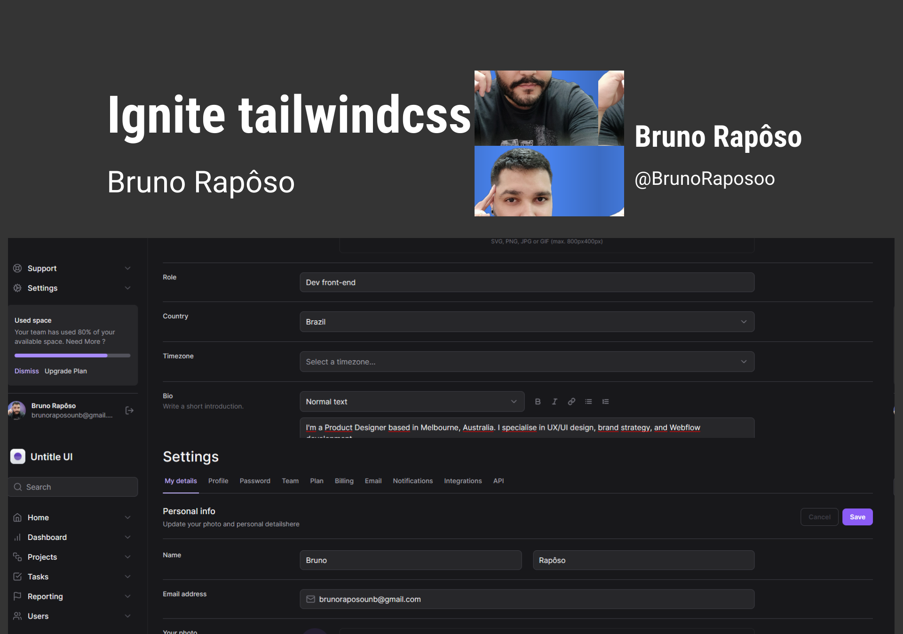

<h1 align="center">
    
</h1>

  <a href="#rocket-tecnologias">Tecnologias</a>&nbsp;&nbsp;&nbsp;|&nbsp;&nbsp;&nbsp;
  <a href="#-projeto">Projeto</a>&nbsp;&nbsp;&nbsp;|&nbsp;&nbsp;&nbsp;
  <a href="#memo-licença">Licença</a>

 

  

 

  

## 🚀 Tecnologias

Esse projeto foi desenvolvido com as seguintes tecnologias:

- [ReactJS](https://pt-br.reactjs.org/)
- [TypeScript](https://www.typescriptlang.org/)
- [NextJs](https://nextjs.org/)
- [Tailwindcss](https://tailwindcss.com/)
- [Framer Motion](https://www.framer.com/motion/)
- [Auto Animate](https://auto-animate.formkit.com/)
- [Radix-UI](https://www.radix-ui.com/)
- [Lucide](https://lucide.dev/guide/packages/lucide-react)

## 💻 Projeto

Projeto feito no curso de React da Rocketseat Ignite. Consiste em desenvolver dashboard para preenchimento de um formulário. O foco do projeto é o tailwindcss para front-end.

## Licença

Esse projeto está sob a licença MIT. Veja o arquivo [LICENSE](LICENSE.md) para mais detalhes.

---